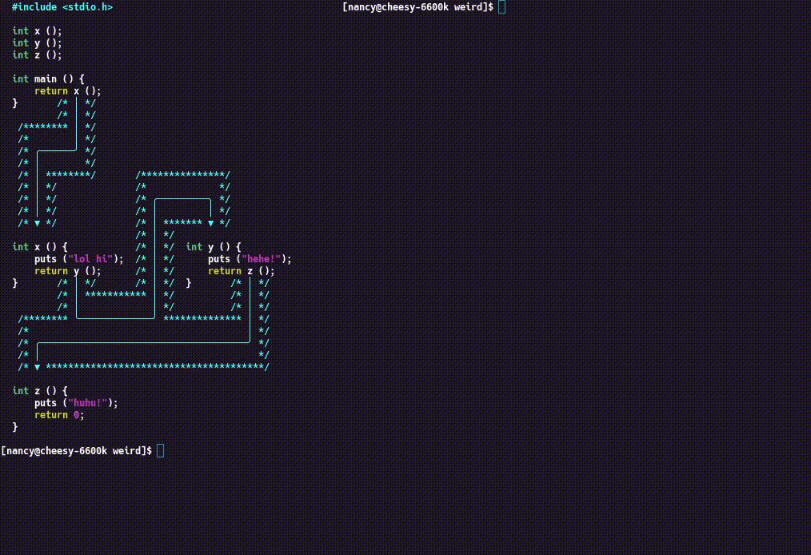

# Side by side functions

do U want ur programs to look like this? ; )

```c
  #include <stdio.h>
  
  int x ();
  int y ();
  int z ();
  
  int main () {
      return x ();
  }       /* │ */
          /* │ */
   /******** │ */
   /*        │ */
   /* ╭──────╯ */
   /* │        */
   /* │ ********/       /***************/
   /* │ */              /*             */
   /* │ */              /* ╭─────────╮ */
   /* │ */              /* │         │ */
   /* ▼ */              /* │ ******* ▼ */
                        /* │ */
  int x () {            /* │ */  int y () {
      puts ("lol hi");  /* │ */      puts ("hehe!");
      return y ();      /* │ */      return z ();
  }       /* │ */       /* │ */  }       /* │ */
          /* │ *********** │ */          /* │ */
          /* │             │ */          /* │ */
   /******** ╰─────────────╯ ************** │ */
   /*                                       │ */
   /* ╭─────────────────────────────────────╯ */
   /* │                                       */
   /* ▼ ***************************************/
  
  int z () {
      puts ("huhu!");
      return 0;
  }

```
(`weird.c`)



## TODO

- make it auto generate these from existing programs
